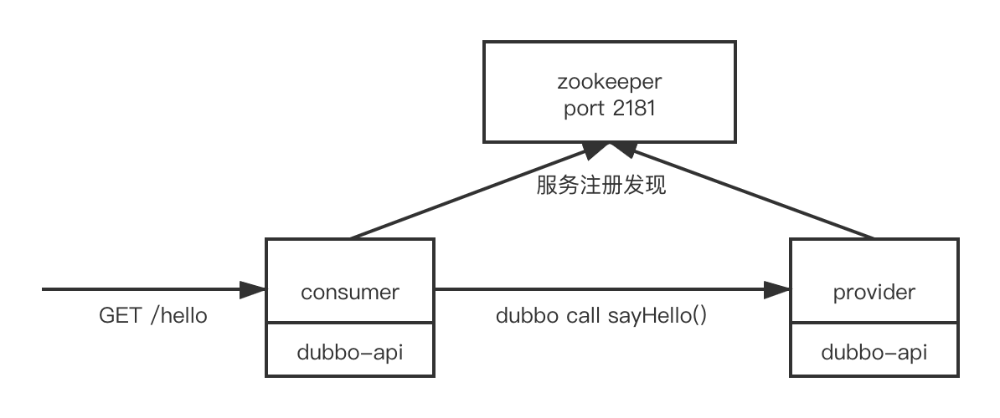

# cloud-test-demo

该项目基于springboot+dubbo编码，应用于基于kubernetes平台的一些测试工作，包含三个子项目`dubbo-api`、`dubbo-consumer`、`dubbo-provider`，且架构如下：

## 构建

### 编译命令

编译命令可以在总项目下运行进行构建，构建完成后会在各个子项目目录下生成`target/`目录（除了`dubbo-api`），在该项目中，`dubbo-api`作为maven依赖被放入到`dubbo-consumer`和`dubbo-provider`当中，若要分别编译子项目，则需先使用`mvn install`将其放入到maven仓库中。

``mvn clean && mvn -Dmaven.test.skip=true``

### 镜像构建

Dockerfile文件位于各个子项目根目录下（事实上，它们的Dockerfile内容一样），各个子项目构建命令为：

``docker build -f {projectDir}/{subProject}/Dockerfile -t {镜像名}:{标签} {projectDir}/{subProject}``

## 配置

在构建镜像完成后，使用JAVA_OPTS环境变量传递运行参数。

例如使用`-Dspring.config.location={applicationYamlFileUrl}`指定jar包加载外部application.yml配置文件。

## 接口

### consumer

consumer作为对外提供服务的聚合层，提供给浏览器调用，其本身会调用provider服务的sayHello()接口，consumer的对外接口如下：

- GET /hello 通过consumer调用provider的sayHello()接口，获取返回的字符串并返回

### provider

provider作为服务提供者，为consumer提供接口，其包含两个对外HTTP接口提供健康检查，接口如下：

- GET /health 健康检查
- POST /health/{status} status为false则设置模拟服务不健康